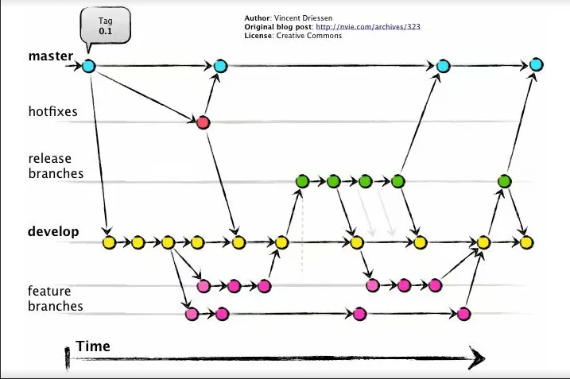

## Buenas Prácticas

## Ramas y Commits

Crearemos ramas siguiendo esta convención de nombres:

TIPO/SCRUM-N°TAREA-BREVE-DESCRIPCION

✅ Ejemplo: DOCS/SCRUM-9-definir-convenciones

Esto asegura consistencia y trazabilidad de las tareas a lo largo del proyecto.
Convención de Mensajes de Commit

Para mantener la claridad en el historial de commits, utilizaremos los siguientes prefijos:

    [FEATURE] → Implementación de nueva funcionalidad

    [FIX] → Corrección de errores

    [IMPROVEMENT] → Tareas de mantenimiento, mejoras de rendimiento o actualizaciones de dependencias

    [DOCS] → Actualizaciones de documentación

    [REFACTOR] → Mejoras en el código que no cambian la funcionalidad

    [TEST] → Adición o mejora de pruebas

    [HOTFIX] → Corrección en producción

## ✅ Ejemplos de Mensajes de Commit:

git commit -m "[FEATURE] Implementar autenticación de usuario"
git commit -m "[FIX] Resolver problema con validación de inicio de sesión"
git commit -m "[IMPROVEMENT] Actualizar dependencias a las versiones más recientes"
Flujo de Trabajo en Git (Git Flow)

Seguiremos un enfoque estructurado de Git Flow para mantener nuestro proceso de desarrollo organizado y fluido.

    * Desarrollo de Funcionalidades

        Crear una nueva rama desde develop usando la convención de nombres de ramas.

        Trabajar en la funcionalidad, haciendo commits con el formato de mensaje adecuado.

    * Pull Request y Revisión

        Una vez la funcionalidad esté lista, se abre un Pull Request (PR) hacia develop.

        Un miembro del equipo revisa el código y proporciona retroalimentación.

    * Merge y Despliegue

        Después de la aprobación, el autor del pull request  fusiona la rama en develop

        Una vez que la rama develop esté lista y validada para fusionar a main con una nueva versión se debe  crear un tag para marcar esta versión específica.

        El nombre del tag debe seguir la convención vX.Y.Z,  (por ejemplo, v1.2.0).

        Los lanzamientos de producción se gestionan desde la rama main.

## ✅ Ejemplo de Comandos de Flujo de Trabajo:

git checkout develop
git pull origin develop
git checkout -b DOCS/SCRUM-9-definir-convencion

Trabajar en la funcionalidad...

git commit -m "[DOCS] Definicion de convencion"
git push origin DOCS/SCRUM-9-definir-convencion

Abrir un PR para fusionar en develop

Una vez listo para finalizar una versión

git tag -a v1.2.0 -m "Release versión 1.2.0"
git push origin v1.2.0

# Tipos de Versiones (Major/Minor/Patch)

Se debe incrementar el número de versión según el tipo de cambios que se hayan realizado:

    Major (Mayor): Cambios incompatibles que rompen la compatibilidad con versiones anteriores.

        Ejemplo: v1.0.0 a v2.0.0.

    Minor (Menor): Funcionalidades nuevas compatibles con versiones anteriores.

        Ejemplo: v1.0.0 a v1.1.0.

    Patch (Parche): Corrección de errores y mejoras menores compatibles con la versión actual.

        Ejemplo: v1.0.0 a v1.0.1.

## Tablero de Gestión de Tareas (JIRA)

Para hacer un seguimiento de nuestro progreso de desarrollo, usamos JIRA con un flujo de trabajo estructurado que consta de cinco estados clave:

    * To-Do 📝 – La tarea ha sido creada y está lista para ser trabajada.

    * In Progress 🚧 – La tarea está siendo desarrollada activamente.

    * Code Review 🔍 – Se ha enviado un pull request (PR) y está esperando revisión (Aprobable solo por el encargado de ver los PRs).

    * Critic Code Review rescue worker’s helmet - Se ha enviado un pull request (PR) Critico y está esperando revisión (Aprobable por cualquier miembro del equipo).

    * Develop ✅ – El PR ha sido aprobado y fusionado con la rama develop.

    * Main 🚀 – La tarea está completada y ha sido fusionada con la rama main (lista para producción).

## Ejemplo de Flujo de Trabajo:

    * Se crea una nueva tarea y se coloca en To-Do.

    * Una vez que empieza el desarrollo, se mueve a In Progress.

    * Cuando la funcionalidad está completa, se abre un PR, y la tarea se mueve a Code Review.

    * Si es aprobada, la rama se fusiona con develop, y la tarea se mueve a Develop.

    * Cuando la funcionalidad se incluye en un release y se fusiona con main, la tarea se mueve a Main y se considera hecha.

Este enfoque estructurado asegura una clara visibilidad de las tareas, una colaboración fluida y un ciclo de desarrollo eficiente. 🚀
